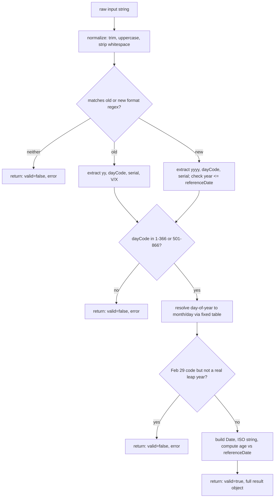
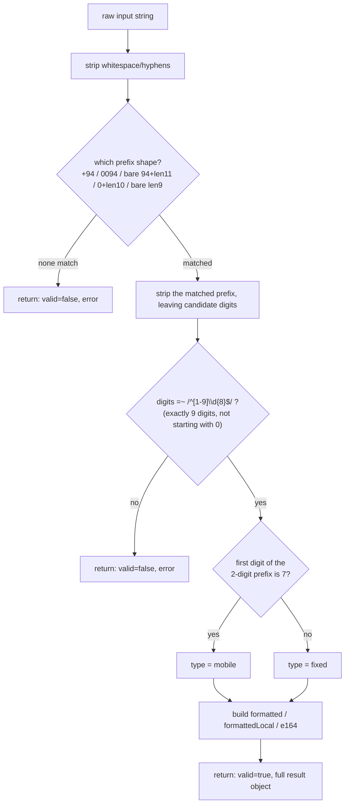
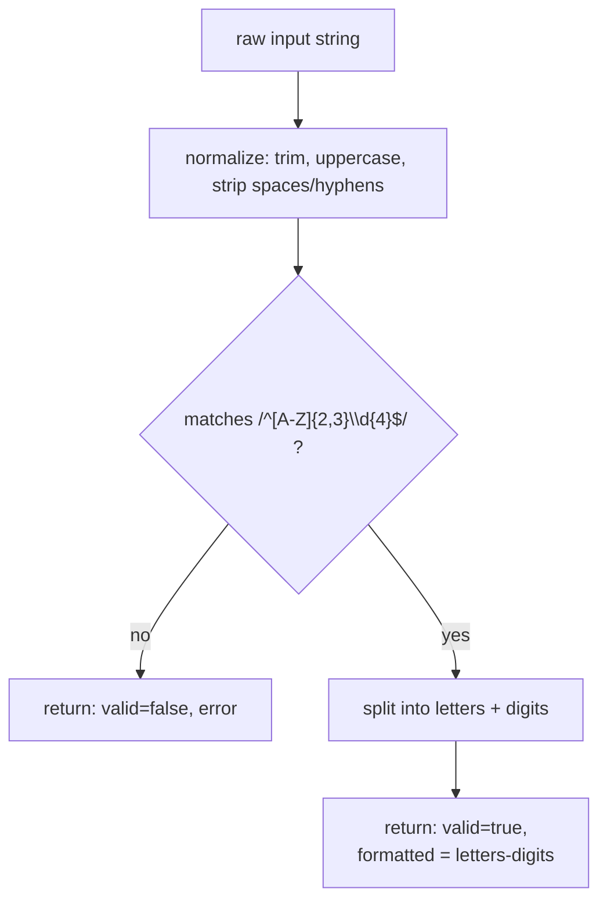
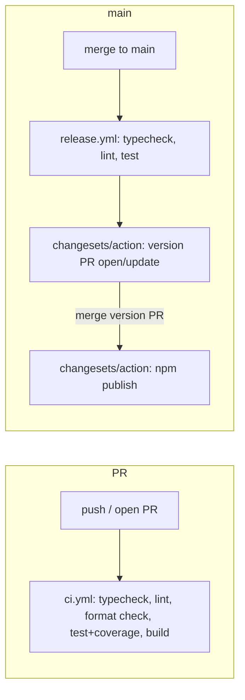

# Architecture

This document orients both human contributors and AI assistants working on
`ceylonic`. Read this before making structural changes; keep it in sync
with the code.

## 1. Purpose & scope

`ceylonic` is a zero-dependency TypeScript utility library for a small set
of narrow, Sri Lanka-specific problems: parsing/validating National
Identity Card (NIC) numbers, phone numbers, and vehicle registration
numbers; and formatting dates, relative time, currency, and numbers the
way they're conventionally written in Sinhala. It is **not** a
general-purpose i18n library, not a full Sinhala transliteration/grammar
engine, and not an official government/telecom/DMV API — none of the
parsing modules confirm that an input was actually issued to a real
person or vehicle, they only decode/validate the _structure_ of the
string. In particular:

- `convertToNewNIC` produces a structurally-plausible new-format NIC, not
  an officially-issued one (see §4).
- `phone.ts` validates the numbering-plan _shape_ of a phone number; it
  does not identify a specific network operator or confirm the number is
  actually in service (see §5).
- `vehicle.ts` validates only the current (2011-onward) plate format; it
  does not recognize older/legacy formats or claim any geographic/vehicle-
  class meaning for the letters (see §6).

## 2. Repository map

```
src/
  nic.ts        # NIC domain: parseNIC, isValidNIC, convertToNewNIC
  phone.ts      # Phone number domain: parsePhoneNumber, isValidPhoneNumber
  vehicle.ts    # Vehicle registration domain: parseVehicleNumber, isValidVehicleNumber
  format.ts     # Sinhala formatting domain: dates, relative time, currency, numbers
  index.ts      # Root entry point — re-exports all four domains, nothing else
test/
  nic.test.ts      # NIC domain tests (formats, boundaries, leap years, referenceDate)
  phone.test.ts    # Phone domain tests (input variants, mobile/fixed classification)
  vehicle.test.ts  # Vehicle domain tests (letter/digit boundaries, normalization)
  format.test.ts   # Formatting domain tests
  index.test.ts    # Confirms the root entry re-exports match the subpath entries
examples/
  nic.ts        # Runnable usage demo for the nic domain
  phone.ts      # Runnable usage demo for the phone domain
  vehicle.ts    # Runnable usage demo for the vehicle domain
  format.ts     # Runnable usage demo for the format domain
.changeset/     # Pending changelog entries + Changesets config (see §12)
.github/workflows/
  ci.yml        # typecheck + lint + format + test + build, on PR and push to main
  release.yml   # Changesets version/publish flow, on push to main
tsup.config.ts     # Build config: 5 entry points (index, nic, phone, vehicle, format), ESM+CJS+dts
vitest.config.ts   # Test runner + coverage thresholds
eslint.config.js   # Flat ESLint config (typescript-eslint + Prettier interop)
tsconfig.json      # Strict TS config shared by tsc, tsup, and editors
```

There is deliberately no `src/internal/` directory yet — see §3.

## 3. Module boundaries

Four domains: **`nic`**, **`phone`**, **`vehicle`**, and **`format`**. Each
is a single file exporting a small, stable public surface (see their
TSDoc for the authoritative list).

**Rule: no domain file may import from another domain file.** If you find
yourself wanting to share a helper between them, put it in `src/internal/`
(create the directory when the first real shared helper appears) and have
both domains import from there — never let one domain depend on another
directly. This keeps each subpath import (`ceylonic/nic`, `ceylonic/phone`,
`ceylonic/vehicle`, `ceylonic/format`) truly independent and
tree-shakeable: someone importing only `ceylonic/nic` should never pull in
Sinhala month names, and vice versa. As of this writing every domain's
"normalize the input string" helper is a few lines duplicated locally
rather than shared — see §8 for why that's the right call at this size.

`index.ts` is the one exception allowed to import from both — it's a
convenience aggregator, not a domain module.

## 4. Domain knowledge: NIC encoding

This is the section you'll need most. Both NIC formats encode the same
underlying information; the new format just widens the year field.

**Old format** — 9 digits + `V`/`X`, e.g. `853400070V`:

| Digits  | Meaning                                    |
| ------- | ------------------------------------------ |
| `YY`    | Last 2 digits of birth year (always 1900s) |
| `DDD`   | Day-of-year code (see below)               |
| `NNNN`  | Serial number                              |
| `V`/`X` | `V` = voting-eligible, `X` = not           |

**New format** — 12 digits, e.g. `198534000070`:

| Digits | Meaning                                                 |
| ------ | ------------------------------------------------------- |
| `YYYY` | Full birth year                                         |
| `DDD`  | Day-of-year code (same encoding as old format)          |
| `M`    | A single marker digit (see "The marker digit" below)    |
| `NNNN` | Serial number (matches the old format's serial exactly) |

### The day-of-year code and the fixed Feb-29 rule

`DDD` is 1-366 for males, or 501-866 for females (subtract 500 to recover
the real day-of-year). It's derived from a **fixed month-length table** that
always gives February 29 days:

```
Jan Feb Mar Apr May Jun Jul Aug Sep Oct Nov Dec
31  29  31  30  31  30  31  31  30  31  30  31        (sums to 366)
```

This table is used regardless of whether the birth year was an actual leap
year. That's fine for every day except one: code **60** (or **560** for
females) means "Feb 29" in the table, but if the birth year wasn't really a
leap year, there is no Feb 29 to map it to. `parseNIC` rejects that specific
combination as invalid (`dayOfYearToDate` in `nic.ts` returns `null`, which
`parseNIC` turns into a result with `valid: false`) rather than silently
coercing it to Mar 1 or Feb 28 — an impossible birth date is a strong
signal of a typo or fabricated number.

Everything else about the table is a pure arithmetic lookup: subtract each
month's fixed length from the code until it fits within a month, and that
remainder is the day. Because the table sums to exactly 366 and callers
only ever pass codes already validated to `[1, 366]`, the lookup always
terminates with a real `{ month, day }` (see the `v8 ignore` comment on the
final `return null` in `dayOfYearToDate` — it's an unreachable safety net,
not live behavior).

### Gender offset

Codes 1-366 are male; 501-866 are female (day = code − 500). There is no
code range for anything else — 0, 367-500, and 867+ are all invalid.

### The marker digit (new format)

When the government introduced 4-digit years, they needed one more digit
to keep the total at 12 (old format's `V`/`X` character became a digit
instead). `convertToNewNIC` inserts a literal `"0"` immediately after the
day code and before the serial. **This is not a documented checksum** —
there is no public algorithm for validating or deriving this digit, so
`ceylonic` treats it as structural filler, not something to verify. `nic.ts`
reflects this in how it parses new-format input: it reads the **last 4
digits** as the serial (matching the old format's serial for the same
registrant) and treats the digit right after the day code as an opaque
marker it doesn't expose as a field. This is why
`parseNIC(convertToNewNIC(oldNic)).serial === parseNIC(oldNic).serial` — the
round trip is intentional and tested (`test/nic.test.ts`).

### Voting eligibility

Old-format only. `V` → `votingEligible: true`, `X` → `false`. New-format
NICs carry no equivalent marker, so `votingEligible` is always `null` for
them.

## 5. Domain knowledge: phone numbers

`phone.ts` validates and formats numbers under Sri Lanka's national
numbering plan (country code `+94`). The rules it encodes:

- **National significant number is always 9 digits**, never starting with
  `0`. Written locally it's prefixed with a trunk `0` (10 digits total,
  e.g. `0771234567`); written internationally it's prefixed with the
  country code (e.g. `+94771234567`).
- **The first 2 digits are a prefix** that splits into two disjoint
  blocks: `7x` (i.e. `70`-`79`) is reserved for mobile numbers; every
  other value (`11`, `21`, `81`, `91`, etc.) is a fixed-line area code.
  `parsePhoneNumber` classifies `type` from this split alone.
- **`parsePhoneNumber` accepts, and normalizes, several real-world input
  shapes**: local with trunk `0`, international with `+94`, bare `94`
  (no `+`), the `0094` IDD prefix, and a bare 9-digit national number —
  all with optional spaces/hyphens. See the flowchart in §9.

**Deliberately out of scope**, and why:

- **No operator identification** (Dialog/Mobitel/Hutch/etc.). Sri Lanka's
  operator-to-prefix mapping has changed with mergers and acquisitions in
  the past and will again — hard-coding a mapping into a published
  library would go stale silently. `type` only distinguishes
  mobile/fixed, which is a stable structural fact.
- **No area-code-to-city lookup** (e.g. `011` → Colombo). This would
  require an exhaustive, verified table this project doesn't have a
  confident source for; getting a handful of the ~30 area codes wrong is
  worse than not offering the feature. `prefix` is exposed as raw digits
  so callers who have their own verified table can do this lookup
  themselves.
- **No short-code/special-number recognition** (`1919`, `1900`, etc.) —
  a different, much smaller numbering space than ordinary subscriber
  numbers, out of scope for this module.

## 6. Domain knowledge: vehicle registration numbers

`vehicle.ts` validates only the **current** Sri Lankan plate format,
issued since letter-prefix combinations were widened around 2011: 2 or 3
uppercase letters followed by exactly 4 digits (e.g. `CAB-1234`).

**Deliberately out of scope**, and why — this is the most conservative
domain module in the library, on purpose:

- **No legacy/pre-2011 plate formats** (shorter letter prefixes, older
  province-letter series, etc.). Unlike the NIC's day-of-year encoding
  (§4), which is a single, well-documented government scheme, Sri Lanka's
  vehicle plates have gone through multiple format eras without one
  authoritative public specification this project could verify against.
  Guessing at the old rules risks encoding wrong "facts" into a published
  library — a `valid: false` for an unsupported legacy plate is far
  better than a confidently wrong `valid: true`/`false` on a rule that
  was never actually verified. A legacy plate simply fails to parse with
  the current format's error message.
- **No claimed meaning for the letters.** Under the current scheme the
  letter prefix is a sequential administrative series, not a documented
  code — `vehicle.ts` never infers a province, vehicle class, or
  registration date from it, unlike `nic.ts`'s day-of-year code, which
  _is_ documented and safe to decode.

If a verified specification for legacy formats becomes available, extend
`vehicle.ts` following the same "document the real rule, or don't encode
it" principle used throughout this codebase — see §5's phone-number
scoping and §4's NIC marker-digit honesty for the pattern to match.

## 7. Domain knowledge: Sinhala formatting conventions

- **Months/weekdays** (`SINHALA_MONTHS`, `SINHALA_WEEKDAYS`) are plain
  lookup tables, calendar-ordered (`SINHALA_WEEKDAYS[0]` is Sunday, matching
  `Date#getDay()`).
- **Currency grouping**: `"standard"` groups every 3 digits (1,500,000);
  `"lakh"` groups the last 3 digits together, then every 2 digits after that
  (15,00,000) — the conventional South Asian lakh/crore grouping.
- **Number-to-words grammar**: Sinhala compounds numerals rather than
  spacing every component. For example the hundreds-place prefix fuses
  directly onto the following thousand-word with no space
  (`numberToSinhalaWords(500_000)` → hundreds fused into `...දහස`), while
  the hundreds and tens/ones within one three-digit group are
  space-separated (`101` → `"එකසිය එක"`). This isn't inconsistent — it
  mirrors how the compound words are actually pronounced/written. If you
  add a new numeral range (e.g. billions), follow the existing
  `belowHundred` / `belowThousand` composition pattern in `format.ts`
  rather than inventing a new one.
- Word-conversion is capped at 999,999,999 — see §8 for why.

## 8. Design decisions & tradeoffs

- **Zero dependencies.** The entire problem space (string parsing, date
  arithmetic, string formatting) is well within what the language provides.
  A dependency here would only add supply-chain risk and version-conflict
  surface for consumers, for no functional benefit.
- **Result objects instead of throwing in `nic.ts`.** NIC strings come from
  end users (forms, uploads, OCR) — malformed input is an expected, common
  case, not a bug. Forcing every caller into `try/catch` for an expected
  outcome is worse ergonomics than a discriminated result object. Contrast
  with `format.ts`, where bad arguments (wrong type, `NaN` date, negative
  decimals) are near-certainly programmer errors, so those throw
  immediately — the standard "fail fast on bugs, degrade gracefully on
  data" split.
- **Dual ESM/CJS.** Consumers on older bundlers or plain `require()` still
  exist; publishing CJS-only would exclude ESM-first tooling's optimizations
  (tree-shaking), and ESM-only would break `require()` consumers. `tsup`
  produces both from one source with no hand-maintained build step.
- **Subpath exports (`ceylonic/nic`, `ceylonic/phone`, `ceylonic/vehicle`,
  `ceylonic/format`).** Someone validating NICs in a form backend shouldn't
  ship Sinhala month/weekday tables in their bundle, and vice versa.
  Subpaths make that split explicit and enforceable (see §3's
  import-boundary rule) rather than relying on tree-shaking to catch it.
- **Duplicated normalize/guard helpers instead of a premature
  `src/internal/`.** Every domain file has its own tiny local
  `invalid(error)` builder and input-normalization logic (trim/uppercase/
  strip whitespace) rather than sharing one. Each is a handful of lines,
  and the result-object shape differs per domain anyway (`NICResult` vs.
  `PhoneResult` vs. `VehicleResult`) — a shared abstraction would save
  little and would immediately violate §3's "no domain imports another"
  rule until a _real_ shared helper appears. See §3 for when to actually
  create `src/internal/`.
- **Word-conversion capped at 999,999,999.** Beyond ~a billion, Sinhala
  numeral compounding conventions get genuinely ambiguous/rare in real
  usage (billions are almost always spoken as digits, not words, in
  practice), and extending the table correctly needs native-speaker
  verification rather than a guess. Capping and throwing `RangeError` is
  more honest than silently producing a plausible-looking wrong answer.

## 9. Data flow diagrams

### NIC parsing pipeline



### Phone number parsing pipeline



### Vehicle registration parsing pipeline



### Build & release pipeline



## 10. Testing strategy

Tests live in `test/`, one file per domain (`nic.test.ts`, `phone.test.ts`,
`vehicle.test.ts`, `format.test.ts`) plus an `index.test.ts` smoke test
that the root entry point re-exports match the subpath entries exactly
(catches accidental divergence between `index.ts` and the domain files).

Categories covered per domain:

- **Happy path** — one test per exported function per format/option combo.
- **Boundary values** — exact edges of valid ranges (day codes 0/1/366/367/
  500/501/866/867; word-conversion 0/19/20/21/99/100/101/1000/999999999).
- **Domain-specific invariants** — e.g. the Feb-29/leap-year rule
  (including the 1900-is-not-a-leap-year century edge case), gender
  offset, and old↔new serial round-tripping via `convertToNewNIC` for
  `nic.ts`; the `7x` mobile/fixed prefix split across all ten values
  `70`-`79` for `phone.ts`; letter-count and digit-count boundaries for
  `vehicle.ts`.
- **Input normalization** — whitespace, casing, invalid characters, wrong
  lengths.
- **Error-handling policy conformance** — parsing functions (`nic.ts`,
  `phone.ts`, `vehicle.ts`) return `valid: false` and never throw for bad
  input data; formatting functions (`format.ts`) throw
  `TypeError`/`RangeError` for bad arguments.
- **Determinism** — `referenceDate` in `parseNIC` and `now` in
  `formatSinhalaRelative` are always passed explicitly in tests (never
  relying on the real current time), except for one dedicated test per
  function that checks the default-to-`now` behavior itself.

When adding a feature: add the happy-path test first, then ask "what's the
boundary?" and "what's the domain-specific edge case?" before considering
the feature done. Run `npm run test:coverage` — thresholds are enforced at
95% for statements/branches/functions/lines in `vitest.config.ts`; a
genuinely unreachable defensive branch (like the fixed table's terminal
`return null`) is fine to mark with a `/* v8 ignore next */` comment
explaining _why_ it's unreachable, but that should be rare and justified,
not a way to skip writing a real test.

## 11. How to extend: adding a new module

`phone.ts` and `vehicle.ts` are themselves worked examples of this recipe
— read them alongside these steps if you want to see it applied. Say
you're adding a future `holidays` module (Sri Lankan public/poya holiday
lookups) next. Steps:

1. **Create `src/holidays.ts`.** Export a small, focused public API with
   full TSDoc on every export, following the same error-handling policy
   split as an existing domain (does bad input come from users → result
   object; or from programmers → throw?).
2. **Do not import from any other domain file** (`nic.ts`, `phone.ts`,
   `vehicle.ts`, `format.ts`) unless through a new `src/internal/` helper
   shared by all domains that need it — see §3.
3. **Wire up exports:**
   - Add the re-export block to `src/index.ts`.
   - Add a new entry to `tsup.config.ts`'s `entry` map.
   - Add a new `"./holidays"` block to `package.json`'s `exports` map
     (mirror the existing `"./nic"`/`"./phone"`/`"./vehicle"`/`"./format"`
     shape exactly, including the `import`/`require` conditional `types`).
4. **Tests:** add `test/holidays.test.ts` following §10's categories, and
   add its exports to `test/index.test.ts`'s re-export check.
5. **Examples:** add `examples/holidays.ts`, mirroring the existing
   runnable demo files.
6. **Docs:** add a section to `README.md` (with examples for every export)
   and a domain-knowledge section here (following the §4/§5/§6 pattern —
   document the real rule, or explicitly scope out what you're not
   confident enough to encode, the way §5 and §6 do).
7. **Changeset:** run `npx changeset` before opening the PR (see §12).

## 12. Release process

Versioning and publishing go through
[Changesets](https://github.com/changesets/changesets), and are **fully
automatic on every push to `main`** — there is no intermediate "Version
Packages" pull request and no manual merge step:

1. While working on a PR, run `npx changeset` and describe the change and
   its semver bump (patch/minor/major). Commit the generated
   `.changeset/*.md` file alongside your code changes.
2. On push to `main` (i.e. as soon as that PR is merged),
   `.github/workflows/release.yml` checks whether any `.changeset/*.md`
   files are pending. If there are none, the job is a no-op.
3. If changesets are pending, the same run: bumps `package.json` and
   compiles them into `CHANGELOG.md` (`changeset version`), builds `dist/`
   for the new version, and **publishes to npm immediately**
   (`changeset publish`, using the `NPM_TOKEN` repository secret) — all
   before anything is committed back to git.
4. Only after that publish succeeds does the workflow commit the version
   bump (`package.json`, `CHANGELOG.md`, the now-consumed changeset files)
   and push the release tag back to `main` as `github-actions[bot]`. If
   the publish step fails, this commit never happens, so a failed release
   never leaves `main` with an uncommitted version bump.

**This means merging any PR that includes a changeset immediately
publishes a new version to npm** — there is no review checkpoint between
merge and publish. If you want to hold a release back, don't merge the
changeset yet, or ship the change without a changeset and add one in a
follow-up PR when you're ready to release. This also assumes `main`'s
branch protection (if any) allows the release job's `github-actions[bot]`
push through — a "require PR before merging" rule without a bypass for
that actor will make the final commit-back step fail even though the npm
publish itself already succeeded.

No manual `npm version` or `npm publish` — if you need a release, the only
required action is making sure a changeset exists for every user-facing PR.
