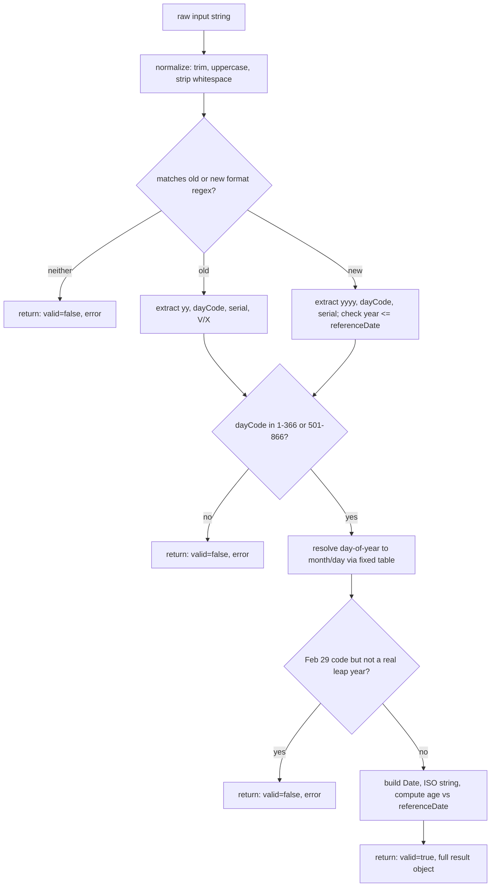
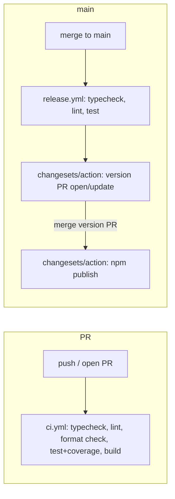

# Architecture

This document orients both human contributors and AI assistants working on
`ceylonic`. Read this before making structural changes; keep it in sync
with the code.

## 1. Purpose & scope

`ceylonic` is a zero-dependency TypeScript utility library for two narrow,
Sri Lanka-specific problems: parsing/validating National Identity Card
(NIC) numbers, and formatting dates, relative time, currency, and numbers
the way they're conventionally written in Sinhala. It is **not** a
general-purpose i18n library, not a full Sinhala transliteration/grammar
engine, and not an official government API — `convertToNewNIC` in
particular produces a structurally-plausible new-format NIC, not an
officially-issued one (see §4).

## 2. Repository map

```
src/
  nic.ts        # NIC domain: parseNIC, isValidNIC, convertToNewNIC
  format.ts     # Sinhala formatting domain: dates, relative time, currency, numbers
  index.ts      # Root entry point — re-exports nic.ts + format.ts, nothing else
test/
  nic.test.ts     # NIC domain tests (formats, boundaries, leap years, referenceDate)
  format.test.ts  # Formatting domain tests
  index.test.ts   # Confirms the root entry re-exports match the subpath entries
examples/
  nic.ts        # Runnable usage demo for the nic domain
  format.ts     # Runnable usage demo for the format domain
.changeset/     # Pending changelog entries + Changesets config (see §9)
.github/workflows/
  ci.yml        # typecheck + lint + format + test + build, on PR and push to main
  release.yml   # Changesets version/publish flow, on push to main
tsup.config.ts     # Build config: 3 entry points (index, nic, format), ESM+CJS+dts
vitest.config.ts   # Test runner + coverage thresholds
eslint.config.js   # Flat ESLint config (typescript-eslint + Prettier interop)
tsconfig.json      # Strict TS config shared by tsc, tsup, and editors
```

There is deliberately no `src/internal/` directory yet — see §3.

## 3. Module boundaries

Two domains: **`nic`** and **`format`**. Each is a single file exporting a
small, stable public surface (see their TSDoc for the authoritative list).

**Rule: `nic.ts` and `format.ts` must never import from each other.** If you
find yourself wanting to share a helper between them, put it in
`src/internal/` (create the directory when the first real shared helper
appears) and have both domains import from there — never let one domain
depend on the other directly. This keeps each subpath import
(`ceylonic/nic`, `ceylonic/format`) truly independent and tree-shakeable:
someone importing only `ceylonic/nic` should never pull in Sinhala month
names, and vice versa.

`index.ts` is the one exception allowed to import from both — it's a
convenience aggregator, not a domain module.

## 4. Domain knowledge: NIC encoding

This is the section you'll need most. Both NIC formats encode the same
underlying information; the new format just widens the year field.

**Old format** — 9 digits + `V`/`X`, e.g. `853400070V`:

| Digits  | Meaning                                    |
| ------- | ------------------------------------------ |
| `YY`    | Last 2 digits of birth year (always 1900s) |
| `DDD`   | Day-of-year code (see below)               |
| `NNNN`  | Serial number                              |
| `V`/`X` | `V` = voting-eligible, `X` = not           |

**New format** — 12 digits, e.g. `198534000070`:

| Digits | Meaning                                                 |
| ------ | ------------------------------------------------------- |
| `YYYY` | Full birth year                                         |
| `DDD`  | Day-of-year code (same encoding as old format)          |
| `M`    | A single marker digit (see "The marker digit" below)    |
| `NNNN` | Serial number (matches the old format's serial exactly) |

### The day-of-year code and the fixed Feb-29 rule

`DDD` is 1-366 for males, or 501-866 for females (subtract 500 to recover
the real day-of-year). It's derived from a **fixed month-length table** that
always gives February 29 days:

```
Jan Feb Mar Apr May Jun Jul Aug Sep Oct Nov Dec
31  29  31  30  31  30  31  31  30  31  30  31        (sums to 366)
```

This table is used regardless of whether the birth year was an actual leap
year. That's fine for every day except one: code **60** (or **560** for
females) means "Feb 29" in the table, but if the birth year wasn't really a
leap year, there is no Feb 29 to map it to. `parseNIC` rejects that specific
combination as invalid (`dayOfYearToDate` in `nic.ts` returns `null`, which
`parseNIC` turns into a result with `valid: false`) rather than silently
coercing it to Mar 1 or Feb 28 — an impossible birth date is a strong
signal of a typo or fabricated number.

Everything else about the table is a pure arithmetic lookup: subtract each
month's fixed length from the code until it fits within a month, and that
remainder is the day. Because the table sums to exactly 366 and callers
only ever pass codes already validated to `[1, 366]`, the lookup always
terminates with a real `{ month, day }` (see the `v8 ignore` comment on the
final `return null` in `dayOfYearToDate` — it's an unreachable safety net,
not live behavior).

### Gender offset

Codes 1-366 are male; 501-866 are female (day = code − 500). There is no
code range for anything else — 0, 367-500, and 867+ are all invalid.

### The marker digit (new format)

When the government introduced 4-digit years, they needed one more digit
to keep the total at 12 (old format's `V`/`X` character became a digit
instead). `convertToNewNIC` inserts a literal `"0"` immediately after the
day code and before the serial. **This is not a documented checksum** —
there is no public algorithm for validating or deriving this digit, so
`ceylonic` treats it as structural filler, not something to verify. `nic.ts`
reflects this in how it parses new-format input: it reads the **last 4
digits** as the serial (matching the old format's serial for the same
registrant) and treats the digit right after the day code as an opaque
marker it doesn't expose as a field. This is why
`parseNIC(convertToNewNIC(oldNic)).serial === parseNIC(oldNic).serial` — the
round trip is intentional and tested (`test/nic.test.ts`).

### Voting eligibility

Old-format only. `V` → `votingEligible: true`, `X` → `false`. New-format
NICs carry no equivalent marker, so `votingEligible` is always `null` for
them.

## 5. Domain knowledge: Sinhala formatting conventions

- **Months/weekdays** (`SINHALA_MONTHS`, `SINHALA_WEEKDAYS`) are plain
  lookup tables, calendar-ordered (`SINHALA_WEEKDAYS[0]` is Sunday, matching
  `Date#getDay()`).
- **Currency grouping**: `"standard"` groups every 3 digits (1,500,000);
  `"lakh"` groups the last 3 digits together, then every 2 digits after that
  (15,00,000) — the conventional South Asian lakh/crore grouping.
- **Number-to-words grammar**: Sinhala compounds numerals rather than
  spacing every component. For example the hundreds-place prefix fuses
  directly onto the following thousand-word with no space
  (`numberToSinhalaWords(500_000)` → hundreds fused into `...දහස`), while
  the hundreds and tens/ones within one three-digit group are
  space-separated (`101` → `"එකසිය එක"`). This isn't inconsistent — it
  mirrors how the compound words are actually pronounced/written. If you
  add a new numeral range (e.g. billions), follow the existing
  `belowHundred` / `belowThousand` composition pattern in `format.ts`
  rather than inventing a new one.
- Word-conversion is capped at 999,999,999 — see §6 for why.

## 6. Design decisions & tradeoffs

- **Zero dependencies.** The entire problem space (string parsing, date
  arithmetic, string formatting) is well within what the language provides.
  A dependency here would only add supply-chain risk and version-conflict
  surface for consumers, for no functional benefit.
- **Result objects instead of throwing in `nic.ts`.** NIC strings come from
  end users (forms, uploads, OCR) — malformed input is an expected, common
  case, not a bug. Forcing every caller into `try/catch` for an expected
  outcome is worse ergonomics than a discriminated result object. Contrast
  with `format.ts`, where bad arguments (wrong type, `NaN` date, negative
  decimals) are near-certainly programmer errors, so those throw
  immediately — the standard "fail fast on bugs, degrade gracefully on
  data" split.
- **Dual ESM/CJS.** Consumers on older bundlers or plain `require()` still
  exist; publishing CJS-only would exclude ESM-first tooling's optimizations
  (tree-shaking), and ESM-only would break `require()` consumers. `tsup`
  produces both from one source with no hand-maintained build step.
- **Subpath exports (`ceylonic/nic`, `ceylonic/format`).** Someone validating
  NICs in a form backend shouldn't ship Sinhala month/weekday tables in
  their bundle, and vice versa. Subpaths make that split explicit and
  enforceable (see §3's import-boundary rule) rather than relying on
  tree-shaking to catch it.
- **Word-conversion capped at 999,999,999.** Beyond ~a billion, Sinhala
  numeral compounding conventions get genuinely ambiguous/rare in real
  usage (billions are almost always spoken as digits, not words, in
  practice), and extending the table correctly needs native-speaker
  verification rather than a guess. Capping and throwing `RangeError` is
  more honest than silently producing a plausible-looking wrong answer.

## 7. Data flow diagrams

### NIC parsing pipeline



### Build & release pipeline



## 8. Testing strategy

Tests live in `test/`, one file per domain plus an `index.test.ts` smoke
test that the root entry point re-exports match the subpath entries
exactly (catches accidental divergence between `index.ts` and the domain
files).

Categories covered per domain:

- **Happy path** — one test per exported function per format/option combo.
- **Boundary values** — exact edges of valid ranges (day codes 0/1/366/367/
  500/501/866/867; word-conversion 0/19/20/21/99/100/101/1000/999999999).
- **Domain-specific invariants** — the Feb-29/leap-year rule (including the
  1900-is-not-a-leap-year century edge case), gender offset, old↔new
  serial round-tripping via `convertToNewNIC`.
- **Input normalization** — whitespace, casing, invalid characters, wrong
  lengths.
- **Error-handling policy conformance** — parsing functions return
  `valid: false` and never throw for bad NIC data; formatting functions
  throw `TypeError`/`RangeError` for bad arguments.
- **Determinism** — `referenceDate` in `parseNIC` and `now` in
  `formatSinhalaRelative` are always passed explicitly in tests (never
  relying on the real current time), except for one dedicated test per
  function that checks the default-to-`now` behavior itself.

When adding a feature: add the happy-path test first, then ask "what's the
boundary?" and "what's the domain-specific edge case?" before considering
the feature done. Run `npm run test:coverage` — thresholds are enforced at
95% for statements/branches/functions/lines in `vitest.config.ts`; a
genuinely unreachable defensive branch (like the fixed table's terminal
`return null`) is fine to mark with a `/* v8 ignore next */` comment
explaining _why_ it's unreachable, but that should be rare and justified,
not a way to skip writing a real test.

## 9. How to extend: adding a new module

Say you're adding a future `holidays` module (Sri Lankan public/poya
holiday lookups). Steps:

1. **Create `src/holidays.ts`.** Export a small, focused public API with
   full TSDoc on every export, following the same error-handling policy
   split as an existing domain (does bad input come from users → result
   object; or from programmers → throw?).
2. **Do not import from `nic.ts` or `format.ts`** unless through a new
   `src/internal/` helper shared by all three domains.
3. **Wire up exports:**
   - Add the re-export block to `src/index.ts`.
   - Add a new entry to `tsup.config.ts`'s `entry` map.
   - Add a new `"./holidays"` block to `package.json`'s `exports` map
     (mirror the existing `"./nic"`/`"./format"` shape exactly, including
     the `import`/`require` conditional `types`).
4. **Tests:** add `test/holidays.test.ts` following §8's categories.
5. **Docs:** add a section to `README.md` (with examples for every export)
   and a domain-knowledge subsection to this file's §4/§5 equivalent,
   explaining any non-obvious real-world rules the module encodes.
6. **Changeset:** run `npx changeset` before opening the PR (see §10).

## 10. Release process

Versioning and publishing go through
[Changesets](https://github.com/changesets/changesets):

1. While working on a PR, run `npx changeset` and describe the change and
   its semver bump (patch/minor/major). Commit the generated
   `.changeset/*.md` file alongside your code changes.
2. On merge to `main`, `.github/workflows/release.yml` runs
   `changesets/action`, which opens (or updates) a standing **"Version
   Packages"** pull request that bumps `package.json`'s version and
   compiles all pending changesets into `CHANGELOG.md`.
3. Merging that Version Packages PR triggers the same workflow's `publish`
   step (`npm run release`, i.e. build then `changeset publish`), which
   publishes to npm using the `NPM_TOKEN` repository secret and tags the
   release in git.

No manual `npm version` or `npm publish` — if you need a release, the only
required action is making sure a changeset exists for every user-facing PR.
