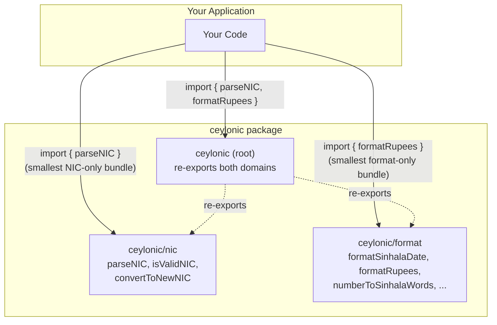
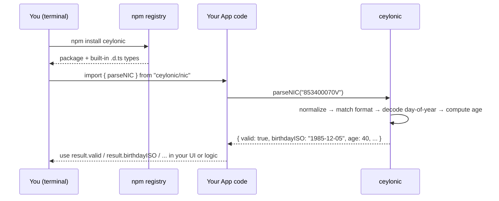
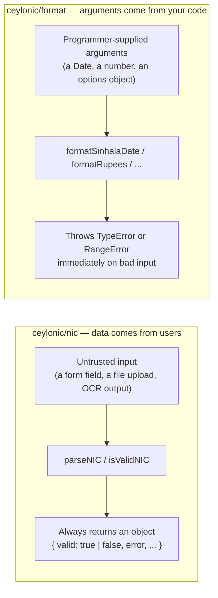
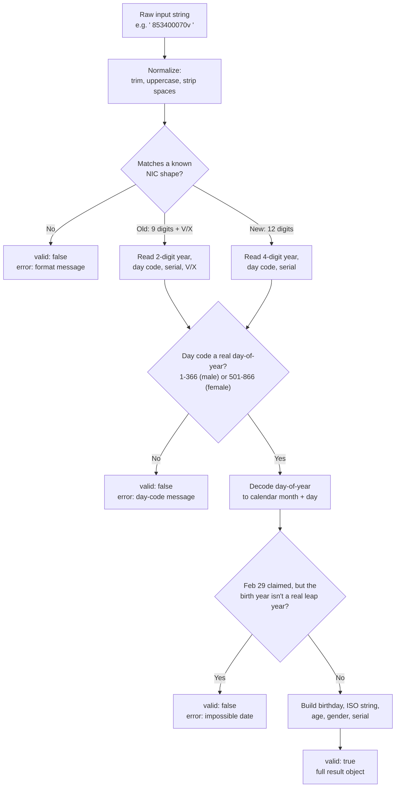

# ceylonic 🇱🇰

**Zero-dependency TypeScript utilities for Sri Lanka-specific data:** National
Identity Card (NIC) parsing/validation, and Sinhala date, relative-time,
currency, and number-to-words formatting.

[](https://github.com/ChamathDilshanC/ceylonic/actions/workflows/ci.yml)
[](https://www.npmjs.com/package/ceylonic)
[](https://www.npmjs.com/package/ceylonic)
[](https://bundlephobia.com/package/ceylonic)
[](./LICENSE)
[](./src)
[](./CONTRIBUTING.md)

No network calls, no telemetry, no runtime dependencies — every function is a
pure, synchronous, local computation. Give it a string or a number, get a
result back.

---

## Table of Contents

- [Overview](#overview)
- [Features](#features)
- [At a Glance](#at-a-glance)
- [Installation](#installation)
- [Quick Start](#quick-start)
- [How ceylonic Is Organized](#how-ceylonic-is-organized)
- [From Install to Output](#from-install-to-output)
- [Error Handling Philosophy](#error-handling-philosophy)
- [NIC Toolkit](#nic-toolkit)
  - [Understanding NIC Formats](#understanding-nic-formats)
  - [parseNIC](#parsenic)
  - [isValidNIC](#isvalidnic)
  - [convertToNewNIC](#converttonewnic)
  - [The Feb 29 Rule](#the-feb-29-rule)
  - [Recipe Validate a NIC in a Signup Form](#recipe-validate-a-nic-in-a-signup-form)
- [Sinhala Formatting Toolkit](#sinhala-formatting-toolkit)
  - [formatSinhalaDate](#formatsinhaladate)
  - [formatSinhalaRelative](#formatsinhalarelative)
  - [formatRupees](#formatrupees)
  - [numberToSinhalaWords](#numbertosinhalawords)
  - [Constants](#constants)
  - [Recipe Invoice Line and Posted Time Ago](#recipe-invoice-line-and-posted-time-ago)
- [TypeScript Support](#typescript-support)
- [Runtime Compatibility](#runtime-compatibility)
- [Quality and Testing](#quality-and-testing)
- [FAQ](#faq)
- [Development](#development)
- [License](#license)

---

## Overview

Sri Lanka issues National Identity Card (NIC) numbers that encode a person's
birth date and gender directly inside the digits, in two formats that are
both still in circulation:

- **Old format** — 9 digits + a letter, e.g. `853400070V`
- **New format** — 12 digits, e.g. `198534000070`

Decoding that string correctly requires domain knowledge that isn't obvious
from the digits alone (a fixed day-of-year table, a gender offset, a
government-specific leap-year quirk). `ceylonic` encapsulates that knowledge
so you don't have to re-derive or re-verify it every time you touch a signup
form, a KYC flow, or an admin dashboard.

The second half of the library covers a different but related gap: rendering
dates, relative time, currency, and numbers the way they're conventionally
written in **Sinhala**, so Sri Lankan-facing UIs don't have to hand-roll
month-name tables and number-to-words logic from scratch.

Both halves are pure functions — no `fetch`, no filesystem access, no global
state. The same code runs identically in Node, a browser, a serverless
function, or a test file.

## Features

- ✅ **Zero runtime dependencies** — smaller install, no supply-chain surface
- ✅ **Strict TypeScript**, fully typed, no `any` in the public API
- ✅ **Dual ESM + CommonJS builds** — works with `import` and `require()`
- ✅ **Tree-shakeable** (`sideEffects: false`) and split into **subpath
  imports** (`ceylonic/nic`, `ceylonic/format`) so you only ship the code you
  actually use
- ✅ **~100% test coverage**, including leap-year and boundary edge cases
  (95% threshold enforced in CI)
- ✅ **100% offline** — every function is a synchronous, local computation;
  nothing is ever sent over the network
- ✅ Works in **Node 18+**, modern bundlers (Vite, webpack, esbuild, Rollup),
  and directly in the browser

## At a Glance

A quick reference for every exported function. Full docs for each are linked
in the [NIC Toolkit](#nic-toolkit) and [Sinhala Formatting
Toolkit](#sinhala-formatting-toolkit) sections below.

| Function                                          | Import from                   | What it does                                              | On bad input                      |
| ------------------------------------------------- | ----------------------------- | --------------------------------------------------------- | --------------------------------- |
| [`parseNIC`](#parsenic)                           | `ceylonic`, `ceylonic/nic`    | Parses an old- or new-format NIC into a structured result | Returns `{ valid: false, error }` |
| [`isValidNIC`](#isvalidnic)                       | `ceylonic`, `ceylonic/nic`    | Quick `true`/`false` validity check                       | Returns `false`                   |
| [`convertToNewNIC`](#converttonewnic)             | `ceylonic`, `ceylonic/nic`    | Converts an old-format NIC to the new 12-digit format     | Returns `null`                    |
| [`formatSinhalaDate`](#formatsinhaladate)         | `ceylonic`, `ceylonic/format` | Formats a `Date` in Sinhala                               | Throws `TypeError`                |
| [`formatSinhalaRelative`](#formatsinhalarelative) | `ceylonic`, `ceylonic/format` | `"3 hours ago"`-style Sinhala relative time               | Throws `TypeError`                |
| [`formatRupees`](#formatrupees)                   | `ceylonic`, `ceylonic/format` | Formats a number as Sri Lankan Rupees                     | Throws `TypeError` / `RangeError` |
| [`numberToSinhalaWords`](#numbertosinhalawords)   | `ceylonic`, `ceylonic/format` | Converts an integer to Sinhala words                      | Throws `RangeError`               |
| `SINHALA_MONTHS`, `SINHALA_WEEKDAYS`              | `ceylonic`, `ceylonic/format` | Lookup constants for month/weekday names                  | —                                 |

## Installation

Install with whichever package manager your project uses:

```bash
npm install ceylonic
```

```bash
pnpm add ceylonic
```

```bash
yarn add ceylonic
```

```bash
bun add ceylonic
```

That's it — no configuration, no peer dependencies, no setup step. TypeScript
types are bundled in the package itself, so there's no separate
`@types/ceylonic` to install.

## Quick Start

```ts
import { parseNIC, formatRupees, formatSinhalaDate } from "ceylonic";

// 1. Decode a NIC
const person = parseNIC("853400070V");
console.log(person.birthdayISO); // "1985-12-05"
console.log(person.gender); // "male"

// 2. Format a currency amount
console.log(formatRupees(1_575_000.5)); // "රු. 1,575,000.50"

// 3. Format a date in Sinhala
console.log(formatSinhalaDate(new Date(2026, 6, 14))); // "2026 ජූලි 14"
```

Prefer smaller bundles? Import only the domain you need — see [How ceylonic
Is Organized](#how-ceylonic-is-organized) below.

```ts
import { parseNIC } from "ceylonic/nic"; // NIC code only
import { formatRupees } from "ceylonic/format"; // Sinhala formatting code only
```

## How ceylonic Is Organized

`ceylonic` is split into two independent domains that never import from each
other, plus a root entry point that re-exports both for convenience. This
means a backend that only validates NICs never pulls in Sinhala month tables,
and a frontend that only formats currency never pulls in NIC-parsing logic.



| Import path       | Pulls into your bundle                       | Best for                                                    |
| ----------------- | -------------------------------------------- | ----------------------------------------------------------- |
| `ceylonic`        | Both NIC and Sinhala-formatting code         | Apps that use both domains and don't mind the combined size |
| `ceylonic/nic`    | Only NIC parsing/validation logic            | Backends, forms, and KYC flows that only validate NICs      |
| `ceylonic/format` | Only Sinhala date/currency/number formatting | UIs that only need Sinhala display formatting               |

## From Install to Output

The end-to-end flow, from running the install command to seeing a parsed
result in your app:



No build step, no codegen, no async initialization — the first line you call
is the first line that returns a usable result.

## Error Handling Philosophy

This is the one design decision worth understanding before you write code
against `ceylonic`, because it's **different between the two modules on
purpose**:



- **`ceylonic/nic` never throws for malformed NIC input.** A NIC string
  almost always originates from a human (a signup form, a scanned document,
  a CSV import) — malformed input is an expected, everyday case, not a bug.
  `parseNIC` always returns a result object; check `result.valid` and
  `result.error` instead of wrapping calls in `try/catch`.
- **`ceylonic/format` throws for bad arguments.** A `Date` object, a number,
  or an options object here is something _your code_ constructed — there's
  no "user input" to gracefully degrade. An invalid `Date` or a negative
  `decimals` count is almost certainly a bug in the calling code, so these
  functions fail fast with `TypeError`/`RangeError` rather than silently
  producing a wrong-looking string.

This split is deliberate and documented in
[ARCHITECTURE.md](./ARCHITECTURE.md#6-design-decisions--tradeoffs) — please
don't blur it in either direction in a PR without discussing it first.

## NIC Toolkit

### Understanding NIC Formats

Both formats encode the same underlying information — the new format just
widens the year field from 2 digits to 4. Reading the digit layout left to
right:

**Old format** (9 digits + `V`/`X`), e.g. `853400070V`:

```
8 5   3 4 0   0 0 7 0   V
└┬┘   └─┬─┘   └──┬──┘   │
 YY    DDD      NNNN   V/X
 │      │         │      └─ V = voting-eligible, X = not eligible
 │      │         └──────── 4-digit serial number
 │      └────────────────── day-of-year code (1-366 male, 501-866 female)
 └───────────────────────── last 2 digits of birth year (assumed 19xx)
```

**New format** (12 digits), e.g. `198534000070`:

```
1 9 8 5   3 4 0   0   0 0 7 0
└───┬───┘ └─┬─┘   │   └──┬──┘
  YYYY     DDD    M     NNNN
   │        │     │      └─── 4-digit serial (matches the old format's serial)
   │        │     └────────── marker digit — structural filler, not a checksum
   │        └──────────────── day-of-year code (same table as the old format)
   └───────────────────────── full 4-digit birth year
```

> The digit marked `M` has no publicly documented checksum meaning — it's a
> structural placeholder introduced when the government widened the year
> field, not an authoritative check digit. See
> [ARCHITECTURE.md §4](./ARCHITECTURE.md#4-domain-knowledge-nic-encoding)
> for the full history.

### parseNIC

**Signature:** `parseNIC(nic: string, referenceDate?: Date): NICResult`

The core function — decodes a NIC string into a full result object. Input is
normalized (trimmed, uppercased, internal whitespace stripped) before
matching, so `" 853400070v "` parses identically to `"853400070V"`.



```ts
import { parseNIC } from "ceylonic/nic";

// Pin a referenceDate for deterministic, testable output
parseNIC("853400070V", new Date("2026-07-15"));
// {
//   valid: true,
//   format: "old",
//   birthYear: 1985,
//   birthday: Date,          // UTC midnight, 1985-12-05
//   birthdayISO: "1985-12-05",
//   gender: "male",
//   age: 40,                 // as of the referenceDate
//   votingEligible: true,    // "V" suffix
//   serial: "0070",
//   formatted: "853400070V",
//   error: null,
// }

// referenceDate defaults to `now` when omitted
parseNIC("853400070V").age; // current age, computed against the real clock

// Invalid input never throws — check `valid` / `error` instead
parseNIC("not-a-nic");
// { valid: false, error: "Invalid NIC format. Expected 9 digits + V/X (old) or 12 digits (new).", ...rest: null }
```

Every field in the returned `NICResult`:

| Field            | Type                         | Description                                                            |
| ---------------- | ---------------------------- | ---------------------------------------------------------------------- |
| `valid`          | `boolean`                    | Whether the input was a syntactically and semantically valid NIC       |
| `formatted`      | `string \| null`             | The normalized (trimmed, uppercased) input                             |
| `format`         | `"old" \| "new" \| null`     | Which NIC format matched                                               |
| `birthYear`      | `number \| null`             | Four-digit birth year                                                  |
| `birthday`       | `Date \| null`               | Birthday as a UTC `Date`                                               |
| `birthdayISO`    | `string \| null`             | Birthday as an ISO `YYYY-MM-DD` string                                 |
| `gender`         | `"male" \| "female" \| null` | Derived from the day-of-year code                                      |
| `age`            | `number \| null`             | Age in whole years as of `referenceDate` (defaults to now)             |
| `votingEligible` | `boolean \| null`            | Old format only — `true` for `V`, `false` for `X`, `null` for new      |
| `serial`         | `string \| null`             | 4-digit serial, consistent between old/new formats for the same person |
| `error`          | `string \| null`             | Human-readable reason parsing failed, or `null` if valid               |

### isValidNIC

**Signature:** `isValidNIC(nic: string): boolean`

A quick boolean check, equivalent to `parseNIC(nic).valid` — use this when
you only need a yes/no answer (e.g. a form field's inline validity state).

```ts
import { isValidNIC } from "ceylonic/nic";

isValidNIC("200015600125"); // true
isValidNIC("850600070V"); // false — Feb 29 in 1985, a non-leap year
```

### convertToNewNIC

**Signature:** `convertToNewNIC(nic: string): string | null`

Converts an old-format NIC to the new 12-digit format. New-format input is
returned unchanged; invalid input returns `null`.

```ts
import { convertToNewNIC } from "ceylonic/nic";

convertToNewNIC("853400070V"); // "198534000070"
convertToNewNIC("198534000070"); // "198534000070" — already new format
convertToNewNIC("invalid"); // null
```

> **Important:** the marker digit this inserts has no publicly documented
> checksum meaning (see the digit layout diagram above) — treat the output
> as structurally plausible for display/lookup purposes, not as an
> officially-issued NIC. For authoritative new-format NICs, the source is
> always the Department for Registration of Persons.

### The Feb 29 Rule

Sri Lankan NICs encode a birth date as a **day-of-year code**, derived from a
month-length table that always treats February as having **29 days** —
regardless of whether the birth year was an actual leap year:

```
Jan Feb Mar Apr May Jun Jul Aug Sep Oct Nov Dec
31  29  31  30  31  30  31  31  30  31  30  31        (sums to 366)
```

This is a real quirk of the government's original encoding scheme, not a bug
in this library. Day-of-year code **60** (or **560** for females) always
means "Feb 29" in that table — but if the birth year encoded in the NIC
wasn't actually a leap year, there's no real Feb 29 for that code to map to.

`ceylonic` treats that specific combination as **invalid** rather than
silently rounding to Mar 1 or Feb 28, because it's the one case where the
government's fixed table and the real Gregorian calendar disagree — and a
NIC with an impossible birth date is a strong signal of a typo or a
fabricated number, which callers should be able to detect.

```ts
parseNIC("850600070V").valid; // false — 1985 is not a leap year
parseNIC("040600070V").valid; // true  — 1904 is a leap year
parseNIC("040600070V").birthdayISO; // "1904-02-29"
```

> **Do not "fix" this behavior.** It is correct per the real-world NIC
> encoding scheme. See
> [ARCHITECTURE.md §4](./ARCHITECTURE.md#4-domain-knowledge-nic-encoding)
> before touching `dayOfYearToDate` in `src/nic.ts`.

### Recipe: Validate a NIC in a Signup Form

A realistic end-to-end example — validate a NIC, enforce a minimum age, and
surface a friendly error message, all without a single `try/catch`:

```ts
import { parseNIC } from "ceylonic/nic";

function validateSignupForm(nicInput: string) {
  const result = parseNIC(nicInput);

  if (!result.valid) {
    return { ok: false, message: result.error };
  }

  if (result.age !== null && result.age < 18) {
    return { ok: false, message: "You must be at least 18 years old to register." };
  }

  return { ok: true, birthday: result.birthdayISO, gender: result.gender };
}

validateSignupForm("853400070V");
// { ok: true, birthday: "1985-12-05", gender: "male" }

validateSignupForm("not-a-nic");
// { ok: false, message: "Invalid NIC format. Expected 9 digits + V/X (old) or 12 digits (new)." }
```

## Sinhala Formatting Toolkit

### formatSinhalaDate

**Signature:** `formatSinhalaDate(date: Date, options?: SinhalaDateOptions): string`

```ts
import { formatSinhalaDate } from "ceylonic/format";

formatSinhalaDate(new Date(2026, 6, 14));
// "2026 ජූලි 14"

formatSinhalaDate(new Date(2026, 6, 14), { weekday: true, suffix: true });
// "2026 ජූලි 14 වන දින, අඟහරුවාදා"

formatSinhalaDate(new Date(2026, 6, 14), { style: "short" });
// "2026-07-14"

// Bad argument -> throws immediately (see Error Handling Philosophy)
formatSinhalaDate(new Date("invalid")); // throws TypeError
```

| Option    | Type                  | Default  | Description                                      |
| --------- | --------------------- | -------- | ------------------------------------------------ |
| `weekday` | `boolean`             | `false`  | Append the Sinhala weekday name.                 |
| `style`   | `"long"` \| `"short"` | `"long"` | `"short"` produces `YYYY-MM-DD`.                 |
| `suffix`  | `boolean`             | `false`  | Append the `"වන දින"` ("on the ... day") suffix. |

### formatSinhalaRelative

**Signature:** `formatSinhalaRelative(date: Date, now?: Date): string`

```ts
import { formatSinhalaRelative } from "ceylonic/format";

formatSinhalaRelative(threeHoursAgo); // "පැය 3කට පෙර"
formatSinhalaRelative(inTwoDays); // "දින 2කින්"
```

| Time difference  | Example output                  |
| ---------------- | ------------------------------- |
| < 1 minute       | `"මොහොතකට පෙර"` / `"මොහොතකින්"` |
| minutes          | `"මිනිත්තු 5කට පෙර"`            |
| hours            | `"පැය 3කට පෙර"`                 |
| days             | `"දින 2කින්"`                   |
| ~months (30-day) | `"මාස 2කට පෙර"`                 |
| ~years (365-day) | `"අවුරුදු 1කට පෙර"`             |

Uses fixed-width buckets (minute/hour/day/month≈30d/year≈365d) rather than
calendar-aware arithmetic — see
[ARCHITECTURE.md](./ARCHITECTURE.md#6-design-decisions--tradeoffs) for why
that tradeoff rarely changes the displayed bucket in practice.

### formatRupees

**Signature:** `formatRupees(amount: number, options?: CurrencyOptions): string`

```ts
import { formatRupees } from "ceylonic/format";

formatRupees(1_575_000.5); // "රු. 1,575,000.50"
formatRupees(1_575_000.5, { grouping: "lakh" }); // "රු. 15,75,000.50"
formatRupees(2500, { decimals: 0, symbol: "LKR" }); // "LKR 2,500"
formatRupees(-45.25); // "-රු. 45.25"
```

`"standard"` vs `"lakh"` grouping, side by side — the same amount, formatted
two ways:

```
standard: රු. 1,575,000.50    ← groups every 3 digits (international style)
lakh:     රු. 15,75,000.50    ← groups the last 3, then every 2 (South Asian style)
```

| Option     | Type                     | Default      | Description                                                        |
| ---------- | ------------------------ | ------------ | ------------------------------------------------------------------ |
| `decimals` | `number`                 | `2`          | Decimal places. Must be a non-negative integer.                    |
| `symbol`   | `string`                 | `"රු."`      | Currency prefix.                                                   |
| `grouping` | `"standard"` \| `"lakh"` | `"standard"` | `"lakh"` groups as 2s after the last 3 digits (South Asian style). |

### numberToSinhalaWords

**Signature:** `numberToSinhalaWords(n: number): string`

```ts
import { numberToSinhalaWords } from "ceylonic/format";

numberToSinhalaWords(1985); // "එක්දහස් නවයසිය අසූපහ"
numberToSinhalaWords(150); // "එකසිය පනහ"
numberToSinhalaWords(0); // "බිංදුව"
```

Supports integers `0` to `999,999,999`; throws `RangeError` outside that
range or for non-integers. See
[ARCHITECTURE.md §5](./ARCHITECTURE.md#5-domain-knowledge-sinhala-formatting-conventions)
for the compounding rules this follows (why some parts fuse together with no
space, and others don't).

### Constants

```ts
import { SINHALA_MONTHS, SINHALA_WEEKDAYS } from "ceylonic/format";

SINHALA_MONTHS[0]; // "ජනවාරි"
SINHALA_WEEKDAYS[0]; // "ඉරිදා" (matches Date#getDay(), Sunday-first)
```

### Recipe: Invoice Line and Posted Time Ago

Combining three formatting functions to render a typical Sri Lankan invoice
row and an activity-feed timestamp:

```ts
import { formatRupees, formatSinhalaDate, formatSinhalaRelative } from "ceylonic/format";

function renderInvoiceLine(amountInRupees: number, issuedAt: Date) {
  return {
    amount: formatRupees(amountInRupees, { grouping: "lakh" }),
    issued: formatSinhalaDate(issuedAt, { weekday: true, suffix: true }),
    postedAgo: formatSinhalaRelative(issuedAt), // relative to the real "now"
  };
}

renderInvoiceLine(1_575_000.5, new Date(2026, 6, 14));
// {
//   amount: "රු. 15,75,000.50",
//   issued: "2026 ජූලි 14 වන දින, අඟහරුවාදා",
//   postedAgo: "..." // varies with the current time
// }
```

## TypeScript Support

`ceylonic` is written in strict TypeScript and ships its own `.d.ts`/`.d.cts`
declaration files — there's nothing extra to install, and no `any` types
leak from the public API. Every exported function, interface, and constant
has TSDoc, so hovering over `parseNIC` or `formatRupees` in your editor shows
the same documentation as this README.

## Runtime Compatibility

- **Node.js 18+** (see `engines` in `package.json`)
- **Any modern bundler** — Vite, webpack, esbuild, Rollup, Metro — via the
  dual ESM/CJS build (`tsup`) and `sideEffects: false` for tree-shaking
- **Browsers, directly** — every function relies only on standard JS globals
  (`Date`, `Math`, `RegExp`, string methods); there's no Node-only API
  (`fs`, `Buffer`, etc.) anywhere in the source, so the same code runs
  client-side without a shim
- **CommonJS `require()`** still works for consumers on older tooling

## Quality and Testing

- **~100% test coverage**, with a 95% enforced threshold
  (statements/branches/functions/lines) in `vitest.config.ts`
- Tests cover happy paths, boundary values (day codes, word-conversion
  limits), domain-specific invariants (the Feb-29 rule, gender offsets,
  old↔new serial round-tripping), and error-handling policy conformance
- Every PR runs typecheck, lint, format-check, test+coverage, and build in
  CI before merge — see
  [ARCHITECTURE.md §7](./ARCHITECTURE.md#7-data-flow-diagrams) for the full
  CI/release pipeline diagram
- Releases are managed through [Changesets](https://github.com/changesets/changesets) —
  every user-facing change ships with a changelog entry

## FAQ

**Does `parseNIC` validate against a real government database?**
No. `ceylonic` is a structural/format validator — it decodes what the digits
_encode_ according to the known NIC scheme. It has no network access and
cannot confirm a NIC was actually issued to a real person. Don't use it as a
substitute for official identity verification.

**Is `isValidNIC("850600070V")` returning `false` a bug?**
No — see [The Feb 29 Rule](#the-feb-29-rule). 1985 wasn't a leap year, so day
code 60 (Feb 29) has no valid calendar meaning for that birth year. This is
intentional, documented behavior, not a defect.

**Does `convertToNewNIC` produce an officially valid new-format NIC?**
It produces a _structurally plausible_ one — correct year/day-code/serial,
but the inserted marker digit is not a documented checksum. Don't present its
output as an officially-issued NIC; treat it as a display/lookup convenience.

**Can I use this in React, Vue, Next.js, or a plain browser script?**
Yes. Zero runtime dependencies and no Node-only APIs — see [Runtime
Compatibility](#runtime-compatibility).

**Is any of my data (NIC numbers, amounts, dates) sent anywhere?**
No. Every function is a synchronous, local computation. There is no `fetch`,
no analytics, no telemetry anywhere in the package.

**Do I need to install `@types/ceylonic`?**
No — TypeScript types are built into the package itself.

**What Sri Lankan formats aren't covered here?**
Full Sinhala transliteration/grammar and a general-purpose i18n layer are
explicitly out of scope — see
[ARCHITECTURE.md §1](./ARCHITECTURE.md#1-purpose--scope) for the library's
intended boundaries.

## Development

```bash
git clone https://github.com/ChamathDilshanC/ceylonic.git
cd ceylonic
npm install
npm run verify   # typecheck + lint + test + build
```

See [CONTRIBUTING.md](./CONTRIBUTING.md) for the full setup, PR checklist,
and code-style rules, and [ARCHITECTURE.md](./ARCHITECTURE.md) for how the
codebase is organized, the full domain knowledge behind the NIC encoding and
Sinhala formatting rules, and the recipe for adding a new module.

## License

MIT © Ceylonic Contributors — see [LICENSE](./LICENSE).
